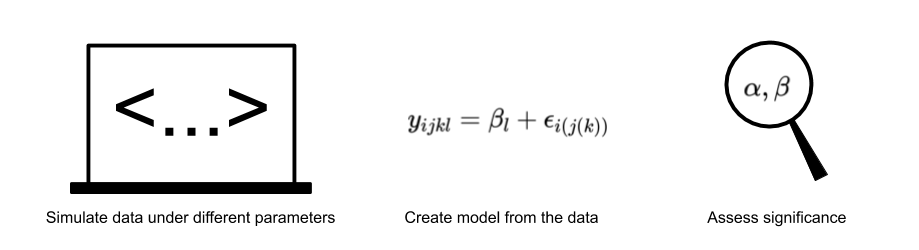

```{r, message = F, warning = F }
library(tidyverse)
library(knitr)
```

# Doing The Simulations



# Creating The "Schedule" Of Subject Observations 

```{r}
# Function for creating backbone for data of an N-of-1 trial
create.backbone = function(order = c("A", "B"), s.freq = 1, 
                           p.length = 1, n.blocks = 1) {
  # Parameters
  # - order: the order that the treatments appear in
  # - s.freq: sampling frequency, how many times a patient will be measured in a 
  #           given treatment period
  # - p.length: period length
  # - n.blocks: how many treatment blocks there are
  
  # Working Assumptions
  # - Assumes that we will only be working with two treatments 
  
  # Build out a block skeleton detailing the treatment schedule for the subject
  single.block = tibble(
    treatment = rep(order, each = s.freq * p.length)
  )
  
  # Append this data structure to itself repeatedly
  all.blocks = NULL
  for (i in 1:n.blocks) {
    all.blocks = bind_rows(all.blocks, single.block)
  }
  
  # Correctly label day of trial and treatment blocks
  all.blocks = all.blocks %>% 
    mutate(
      block = rep(1:n.blocks, each = s.freq * p.length * length(order)),
      day = rep(1:(n.blocks * p.length * length(order)), each = s.freq)
    )
  
  return(all.blocks)
}

# Confirming this works
# Sampling once a day, each treatment period is only one day, 3 blocks...
bb = create.backbone(order = c("A", "B", "B", "A"), 
                    s.freq = 1, p.length = 1, n.blocks = 3)
kable(head(bb))
```

With a schedule of treatments and periods down, we can start to model the carryover and run-in effects. First, we need a proper representation of the different treatments.

# Treatment Objects 

There are three things that we need to know from a treatment:

- its actual effect on the outcome of interest
- the time needed for its effect to completely go away (carry over)
- the time needed for it to reach its full effect (run-in)

```{r}
# Treatment that reduces outcome by 23 points, 2 days to ramp up, 3 days to die
trt.A = list(
  name = "A",
  effect = -30,
  run = 2,
  carry = 3
)

trt.B = list(
  name = "B",
  effect = -50,
  run = 4,
  carry = 2
)

all.trts = list(trt.A, trt.B)
```

We'll need a way to correctly capture when a treatment has carryover/run-in and when to have instantaneous effects.

# Modeling Treatment Effects 

```{r, warning = F, message = F }
expdecay = function(start, target, tau, delta_t) {
  # Parameters
  # - start: the value we want to start at
  # - target: the value we want to end up at after all delta_t
  # - tau: scalar factor for how fast the decay happens (higher = slower decay)
  # - delta_t: vector of numbers to calculate the transition
  
  # Returns
  # - a vector of values going from a start value to a target value in a decay fashion
  
  # Notes:
  # if the decay profile doesn't seem correct, just tune it to your liking
  
  target + (start - target) * exp(-delta_t / tau)
}

model.outcome = function(bb, 
                         trts,
                         mu.b = 100,
                         sd.b = 5,
                         tau.vec = c(1, 1),
                         trt.type = "-") {
  # Parameters
  # - bb: a treatment schedule backbone (create.backbone)
  # - trts: list of treatments to get the effect for
  # - mu.b: mean of the baseline value (what level should outcome take)
  # - sd.b: standard deviation of the baseline
  # - tau.vec: vector of tau values to tune the decay of each treatment
  # - trt.type: indicates if the treatments add/subtract from outcome ("-" for reducing effect)
  
  # Working Assumptions:
  # - just working with a continuous outcome for now
  # - baseline will just have regular (normal) noise
  # - assume that the carryover and run-in of any treatment always will be smaller than the 
  #     treatment period
  # - treatments will just be sequentially named as letters starting at A, B, ... 
  # - both treatments used will have the same effect direction (both reducing, etc)
  
  # Extra:
  # - expand to other outcome types?
  # - allow for interaction between treatments?
  
  # Treatment names
  trt.names = c("A", "B")
  
  # Create treatment effect profiles for all the given treatments
  for (i in 1:length(trts)) {
    
    # Start with simple on/off to place in effects
    bb = bb %>% 
      mutate(
        trt.e = ifelse(treatment == trt.names[i], trts[[i]]$effect, 0)
      )  %>% 
      rename(., name = trt.e) # Janky solution but whatever
    
    # Properly account for carryover and run-in
    
    # Create transition vectors for carryover & run-in based on current treatment
    trt.run.in = expdecay(0, trts[[i]]$effect, tau.vec[i], seq(1:trts[[i]]$run))
    trt.carryover = expdecay(trts[[i]]$effect, 0, tau.vec[i], seq(1:trts[[i]]$carry))
    
    # Detect where the patient actually switches treatment
    # Take the differences of the current treatment effect
    # We know that the patient switches treatment when there is a non-zero difference
    eff.diff = diff(bb$name)
    switch.idx = which(eff.diff != 0)
    
    # Use the indices and sign of the difference to correctly add in decay
    for (idx in switch.idx) {
      # Look at the difference and treatment type to infer carryover vs run-in
      if (eff.diff[idx] < 0) {
        if (trt.type == "-") { 
          # Running in a reducing treatment
          bb$name[(idx + 1):(idx + trts[[i]]$run)] = trt.run.in
        } else {
          # Carryover an additive treatment
          bb$name[(idx + 1):(idx + trts[[i]]$carry)] = trt.carryover
        }
      } else {
        if (trt.type == "-") { 
          # Carryover a reducing treamtment
          bb$name[(idx + 1):(idx + trts[[i]]$carry)] = trt.carryover
        } else {
          # Running in an additive treatment
          bb$name[(idx + 1):(idx + trts[[i]]$run)] = trt.run.in
        }
      } 
    }
    
    # Rename the treatment properly
    colnames(bb)[length(colnames(bb))] = paste(trt.names[i], ".eff", sep = "")
  }
  
  # Calculate the observed effect on the baseline 
  bb = bb %>% 
    mutate(
      baseline = rnorm(nrow(bb), mu.b, sd.b),
      obs = baseline + A.eff + B.eff
    )
  
  return(bb)
}

bb = create.backbone(order = c("A", "B", "B", "A"), 
                     s.freq = 1, p.length = 10, n.blocks = 5)
test = model.outcome(bb, all.trts, 100, 2) %>% 
  pivot_longer(
    ., 
    baseline:obs,
    names_to = "effect",
    values_to = "value"
  )

test %>% 
  ggplot(aes(x = day, y = value, color = effect)) +
  geom_line() +
  labs(
    title = "Visualization of simulated baseline, treatment effects, & observation",
    x = "Day of treatment", 
    y = "Outcome value"
  ) + 
  theme(legend.position = "bottom")
```

# Convenience

```{r}
# Putting the two functions together to make simulations easy
simulate.trial = function(trts, mu.b = 100, sd.b = 5,
                          order = c("A", "B"), s.freq = 1, p.length = 1, n.blocks = 1,
                          tau.vec = c(1, 1), trt.type = "-") {
  
  # Create the backbone
  bb = create.backbone(order, s.freq, p.length, n.blocks)
  
  # Model the treatment effects
  full.data = model.outcome(bb, trts, 
                            mu.b = 100, sd.b = 5,
                            tau.vec = c(1, 1), trt.type = "-")
  
  return(full.data)
}
```

